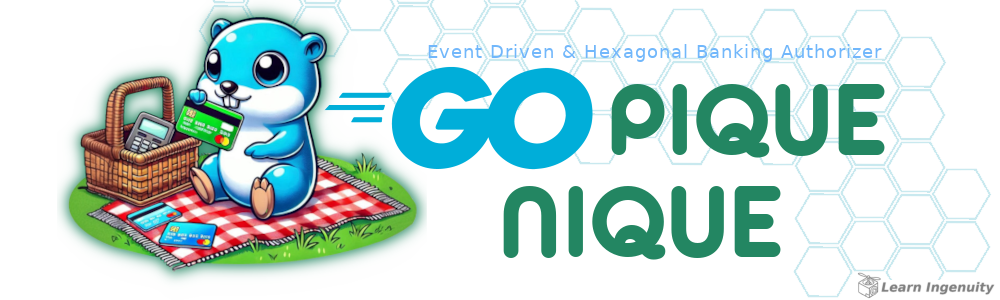

<a id="header"></a>

<!-- 
    Logo image generated by Bing IA: https://www.bing.com/images/create/
    Prompt: gopher azul, simbolo da linguagem golang sentado em chao gramado verde, com uma toalha quadriculada branca e vermelha com uma cest de pique-nique, segurando um cartao de credito verde e uma maquinhas de cartão de credito e cartões em cima da toalha, estilo cartoon, historia em quadrinhos
-->
<div align="center">
<a href="#header">
    
</a>
</div>

<!-- 
    icons by:
    https://devicon.dev/
    https://simpleicons.org/
-->
[](https://go.dev/) [](https://gin-gonic.com/) [](https://www.postgresql.org/) [](https://redis.com/) [](https://rabbitmq.com/) [](https://www.docker.com/) [](https://ubuntu.com/) [](https://github.com/spf13/viper) [](https://github.com/jtonynet) [](https://code.visualstudio.com/) [](https://swagger.io/) [](https://https://miro.com/) [](https://mermaid.js.org/) [](https://docs.github.com/en/actions) <!-- [](https://gatling.com/) [](https://prometheus.io/) [](https://grafana.com/) -->

<!-- 
[](https://nginx.org/en/)  [](https://grafana.com/oss/loki/) [](https://www.jaegertracing.io/) [](https://www.jaegertracing.io/) 
-->


[](#header) <!--[](https://github.com/jtonynet/go-pique-nique/actions) --> [](https://go.dev/)

## 🕸️ Redes

[](https://www.linkedin.com/in/jos%C3%A9-r-99896a39/) [](https://dev.to/learningenuity) [](mailto:learningenuity@gmail.com)

---

## 📁 O Projeto

<a id="index"></a>
### ⤴️ Índice
__🚧 WORK IN PROGRESS!__

__[Go Pique Nique](#header)__<br/>
  1.  ⤴️ [Índice](#index)
  2.  📖 [Sobre](#about)
  3.  💻 [Rodando o Projeto](#run)
      - 🌐 [Ambiente](#environment)
      - 🐋 [Conteinerizado](#run-containerized)
  4.  ✅ [Testes](#tests)
      - 🐋 [Conteinerizado](#test-containerized)
  5.  📊 [Diagramas](#diagrams)
  6. 🧠 [ADR - Architecture Decision Records](#adr)
  7.  🔢 [Versões](#versions)
  8.  🧰 [Ferramentas](#tools)
  9.  🤖 [Uso de IA](#ia)
 10.  🏁 [Conclusão](#conclusion)

---

<br/>

<a id="about"></a>
### 📖 Sobre

__🚧 WORK IN PROGRESS!__

__Resumo:__

> 
> Desafio de `Banking` `REST` Simplificado em `Event Driven` e `Arquitetura Hexagonal`. Previamente elaborado com `Event Storming`
> Construído com `Gin` e `Gorm`,  `RabbitMQ` como serviço de `Mensageria`.
>
> __Principais Tecnologias e abordagens:__
> - `Event Driven Architecture`
> - `Hexagonal Architecture`
> - `TDD`, `DDD`, `SOLID`, `ADRs`
> - `Diagram as code` com `Mermaid.js` e `Miro`
> - `Dockerized` Solução com uso de containers
> - `PostgreSQL` modelado inspirado em `Event Sourcing` para garantir `Consistência`
> - `CI` com `GitHub Actions` 

<div align="center">

<br/>

_*Imagem retirada de sessão do Miro Board do projeto efetuada em 24/12/2024, baseada nos requisitos apresentados._
</div>

<br/>
<div align="center">. . . . . . . . . . . . . . . . . . . . . . . . . . . .</div>
<br/>

__Texto Original:__


> #### Objetivo: `Event Driven & Hexagonal Banking`
> 
> O `Event Driven Banking` Simplificado é uma plataforma de pagamentos simplificada. Nela é possível depositar e realizar transferências
> de dinheiro entre usuários. Temos 2 tipos de usuários, os comuns e lojistas, ambos têm carteira com dinheiro e realizam
> transferências entre eles.
> 
> #### Requisitos
> 
> A seguir estão algumas regras de negócio que são importantes para o funcionamento do `Event Driven Banking Authorizer` Simplificado:
> 
> - Para ambos tipos de usuário, precisamos do `Nome Completo`, `CPF`, `e-mail` e `Senha`. CPF/CNPJ e e-mails devem ser
>   únicos no sistema. Sendo assim, seu sistema deve permitir apenas um cadastro com o mesmo CPF ou endereço de e-mail;
> 
> - Usuários podem enviar dinheiro (efetuar transferência) para lojistas e entre usuários;
> 
> - Lojistas **só recebem** transferências, não enviam dinheiro para ninguém;
> 
> - Validar se o usuário tem saldo antes da transferência;
> 
> - Antes de finalizar a transferência, deve-se consultar um serviço autorizador externo, use este mock
>   [https://util.devi.tools/api/v2/authorize](https://util.devi.tools/api/v2/authorize) para simular o serviço
>   utilizando o verbo `GET`;
> 
> - A operação de transferência deve ser uma transação (ou seja, revertida em qualquer caso de inconsistência) e o
>   dinheiro deve voltar para a carteira do usuário que envia;
> 
> - No recebimento de pagamento, o usuário ou lojista precisa receber notificação (envio de email, sms) enviada por um
>   serviço de terceiro e eventualmente este serviço pode estar indisponível/instável. Use este mock
>   <a href="https://util.devi.tools/api/v1/notify">https://util.devi.tools/api/v1/notify</a> para simular o envio da notificação
>   utilizando o verbo `POST`;
> 
> - Este serviço deve ser RESTFul.
> 
> __Tente ser o mais aderente possível ao que foi pedido, mas não se preocupe se não conseguir atender a todos os requisitos. Durante a entrevista vamos conversar sobre o que você conseguiu fazer e o que não conseguiu.__
> 
> ### Endpoint de transferência
> 
> Você pode implementar o que achar conveniente, porém vamos nos atentar **somente** ao fluxo de transferência entre dois
> usuários. A implementação deve seguir o contrato abaixo.
> 
> ```http request
> POST /transfer
> Content-Type: application/json
> 
> {
>   "value": 100.0,
>   "payer": 4,
>   "payee": 15
> }
> ```
> 
> Caso ache interessante, faça uma **proposta** de endpoint e apresente para os entrevistadores
> 
> #### Avaliação
> 
> Apresente sua solução utilizando o `framework` que você desejar, justificando a escolha.
> Atente-se a cumprir a maioria dos requisitos, pois você pode cumprir-los parcialmente e durante a avaliação vamos bater
> um papo a respeito do que faltou.
> 
> ##### O que será avaliado e valorizamos
> 
> Habilidades básicas de criação de projetos backend:
> - Conhecimentos sobre `REST`
> - Uso do `Git`
> - Capacidade `analítica`
> - Apresentação de `código limpo` e organizado
> 
> Conhecimentos intermediários de construção de projetos manuteníveis:
> - Aderência a recomendações de implementação como as PSRs
> - Aplicação e conhecimentos de `SOLID`
> - Identificação e aplicação de `Design Patterns`
> - Noções de funcionamento e uso de Cache
> - Conhecimentos sobre conceitos de containers (`Docker`, `Podman` etc)
> - `Documentação` e descrição de funcionalidades e manuseio do projeto
> - Implementação e conhecimentos sobre `testes de unidade e integração`
> - Identificar e propor melhorias
> - Boas noções de `bancos de dados relacionais`
> 
> Aptidões para criar e manter aplicações de alta qualidade:
> - Aplicação de conhecimentos de `observabilidade`
> - Utlização de `CI` para rodar testes e análises estáticas
> - Conhecimentos sobre `bancos de dados não-relacionais`
> - Aplicação de arquiteturas (`CQRS`, `Event-Sourcing`, `Microsserviços`, `Monolito modular`)
> - Uso e implementação de `mensageria`
> - Noções de `escalabilidade`
> - Boas habilidades na aplicação do conhecimento do `negócio no software`
> - Implementação margeada por ferramentas de qualidade (`análise estática`, PHPMD, PHPStan, PHP-CS-Fixer etc)
> - Noções de PHP assíncrono
>
> ##### O que NÃO será avaliado
> 
> - Fluxo de cadastro de usuários e lojistas
> - Frontend (só avaliaremos a <a href="https://www.devmedia.com.br/rest-tutorial/28912">API Restful</a>)
> - Autenticação
> 
> ##### O que será um Diferencial
> 
> - Uso de `Docker`
> - Uma cobertura de `testes` consistente
> - Uso de `Design Patterns`
> - `Documentação`
> - Proposta de melhoria na arquitetura
> - Ser consistente e saber `argumentar` suas escolhas
> - Apresentar `soluções que domina`
> - `Modelagem de Dados`
> - `Manutenibilidade` do Código
> - `Tratamento de erros`
> - Cuidado com itens de `segurança`
> - `Arquitetura` (estruturar o pensamento antes de escrever)
> - Carinho em `desacoplar` componentes (outras camadas, `service`, `repository`)

<br/>
<div align="center">. . . . . . . . . . . . . . . . . . . . . . . . . . . .</div>
<br/>

O desafio sugere `PHP` `Assíncrono` ([`Swoole`](https://openswoole.com/) seria a escolha ideal), mas aceita outras linguagens. Realizei em `Golang`, com arquitetura [`Hexagonal`](https://alistair.cockburn.us/hexagonal-architecture/), devido à minha maior experiência e familiaridade, além de ser mencionada na `Job Description` como parte do stack utilizado. Essa combinação atende bem aos requisitos do desafio.

Possuo experiência anterior com `PHP`, mas preferi minha principal stack do momento. Contudo, sou aberto a expandir minhas habilidades e disposto a aprender novas tecnologias e paradigmas ou revisitar conforme necessário.

Visite os [`ADRs`](#adr) do projeto para obter maior contexto.

[⤴️ de volta ao índice](#index)

---

<br/>

<a id="run"></a>
### 💻 Rodando o Projeto

<a id="environment"></a>
#### 🌐 Ambiente

**TODO**

<br/>

[⤴️ de volta ao índice](#index)

---

<br/>

<a id="tests"></a>
### ✅ Testes

<a id="test-containerized"></a>
#### 🐋 Conteinerizado 

**TODO**

[⤴️ de volta ao índice](#index)

<br/>

---

<br/>

<a id="diagrams"></a>
### 📊 Diagramas

**TODO**

[⤴️ de volta ao índice](#index)

<br/>

---

<br/>

<a id="adr"></a> 
### 🧠 ADR - Architecture Decision Records

- [0001: Registro de Decisões de Arquitetura (ADR)](./docs/architecture/decisions/0001-registro-de-decisoes-de-arquitetura.md)
- [0002: Go, Gin, Gorm e PostgreSQL com Arquitetura Hexagonal e TDD](./docs/architecture/decisions/0002-go-gin-gorm-e-postgres-com-arquitetura-hexagonal-tdd.md)
- [0003: Event Driven Architecture](./docs/architecture/decisions/0003-event-driven-architecture.md)

<br/>

[⤴️ de volta ao índice](#index)

---

<br/>

<a id="versions"></a>
### 🔢 Versões

As tags de versões estão sendo criadas manualmente a medida que o projeto avança com melhorias notáveis. Cada funcionalidade é desenvolvida em uma branch a parte (Branch Based, [feature branch](https://www.atlassian.com/git/tutorials/comparing-workflows/feature-branch-workflow)) quando finalizadas é gerada tag e mergeadas em master.

Para obter mais informações, consulte o [Histórico de Versões](./CHANGELOG.md).

<br/>

[⤴️ de volta ao índice](#index)

---

<br/>

<a id="tools"></a>
### 🧰 Ferramentas


- Linguagem:
  - [Go 1.23](https://go.dev/)
  - [GVM v1.0.22](https://github.com/moovweb/gvm)

- Framework & Libs:
  - [Gin](https://gin-gonic.com/)
  - [GORM](https://gorm.io/index.html)
  - [Viper](https://github.com/spf13/viper)
  - [Gin-Swagger](https://github.com/swaggo/gin-swagger)
  - [gjson](https://github.com/tidwall/gjson)
  - [uuid](github.com/google/uuid)
  - [golang-migrate](https://github.com/golang-migrate/migrate)

- Infra & Tecnologias
  - [Docker v24.0.6](https://www.docker.com/)
  - [Docker compose v2.21.0](https://www.docker.com/)
  - [Postgres v16.0](https://www.postgresql.org/)
  - [Redis](https://redis.com/)
  - [RabbitMQ](https://www.rabbitmq.com/)
  <!-- [Gatling](https://gatling.com/) -->

- GUIs:
  - [DBeaver](https://dbeaver.io/)
  - [VsCode](https://code.visualstudio.com/)
    - [Redis Dunn - VsCode Extension](https://marketplace.visualstudio.com/items?itemName=Dunn.redis)
    - [gRPC Clicker - VsCode Extension](https://marketplace.visualstudio.com/items?itemName=Dancheg97.grpc-clicker)

<br/>

[⤴️ de volta ao índice](#index)

---

<br/>

<a id="ia"></a>
### 🤖 Uso de IA

A figura do cabeçalho nesta página foi criada com a ajuda de inteligência artificial e um mínimo de retoques e construção no Gimp [](https://www.gimp.org/)

__Os seguintes prompts foram usados para criação no  [Bing IA:](https://www.bing.com/images/create/)__

<details>
  <summary><b>Gopher Fazendo Pique Nique pagando com Cartão Bancário</b></summary>
"gopher azul, simbolo da linguagem golang sentado em chao gramado verde, com uma toalha quadriculada branca e vermelha com uma cesta de pique-nique, segurando um cartao de credito verde e uma maquinha de cartão de credito e cartões em cima da toalha, estilo cartoon, historia em quadrinhos"<b>(sic)</b>
</details>

<br/>

IA também é utilizada em minhas pesquisas e estudos como ferramenta de apoio; no entanto,  __artes e desenvolvimento são, acima de tudo, atividades criativas humanas. Valorize as pessoas!__

Contrate artistas para projetos comerciais ou mais elaborados e aprenda a ser engenhoso!

[⤴️ de volta ao índice](#index)

<br/>

---

<a id="conclusion"></a>
### 🏁 Conclusão

- TODO

Essas são minhas considerações sobre o que produzi nesse estudo. Continuarei me aplicando aos pontos cegos que não tive tempo ou conhecimento para aprimorar.

<br/>

[⤴️ de volta ao índice](#index)

---

<a id="footer"></a>

>  _"Lifelong Learning & Prosper"_
> <br/> 
>  _Mr. Spock, maybe_   🖖🏾🚀

<div align="center">
<a href="#footer">

<!--  -->
</a>
</div>

