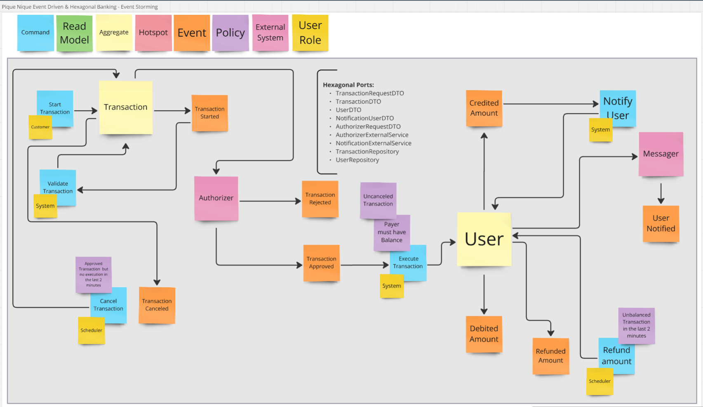

# 3. Event Driven Architecture

Data: 19 de dezembro de 2024

## Status

Proposto

## Contexto

### `Pique Nique EDA` - Escolha de Arquitetura e Abordagem aderentes aos requisitos do Projeto

Este documento tem como objetivo discutir a utilização da [`Event Driven Architecture`](https://en.wikipedia.org/wiki/Event-driven_architecture) no projeto proposto pelo desafio, conforme evidenciado na seção correspondente do arquivo [README](./../../../README.md):

> - Aplicação de arquiteturas ([`CQRS`](https://martinfowler.com/bliki/CQRS.html), [`Event-Sourcing`](https://martinfowler.com/eaaDev/EventSourcing.html), [`Microsserviços`](https://martinfowler.com/articles/microservices.html), Monolito Modular)  
> - Uso e implementação de `mensageria` 

Como visto nos requisitos e restrições do `README` completo, necessitamos construir um sistema `REST` robusto para `Transações Bancárias` autorizadas e com notificação de crédito através de `Serviços Externos`. O mesmo deve contar com `fallback` para correção de falhas.

#### Leituras adicionais:
- [Event-sourcing (ES) em uma Arquitetura de Microsserviços](https://medium.com/@marcelomg21/event-sourcing-es-em-uma-arquitetura-de-microsservi%C3%A7os-852f6ce04595)
- [O que é uma arquitetura orientada por eventos?](https://aws.amazon.com/pt/event-driven-architecture/)
- [Como o Kafka e o RabbitMQ lidam com as mensagens de forma diferente?](https://aws.amazon.com/pt/compare/the-difference-between-rabbitmq-and-kafka/)

## Decisão

### Implementação de `Event Driven Architecture`

Em [Projetos Anteriores](https://github.com/jtonynet/go-payments-api?tab=readme-ov-file#header), enfrentamos a restrição de transações com baixo timeout (100ms) e `síncronas`, o que foi um impeditivo para a adoção de filas e da `Event Driven Architecture`, devido à baixa `latência` exigida nas requisições (A `Latência Adicional` de `filas` clássicas era um impeditivo). Essas restrições não estão presentes no projeto atual. Neste cenário torna-se favorável a utilização dessas ferramentas. 

Neste documento, discutimos a implementação de `Mensageria`, bem como a necessidade de realizar uma sessão de [`Event-Storm`](https://en.wikipedia.org/wiki/Event_storming) para nos ajudar a identificar fluxos e eventos relevantes do `Event-Sourcing`.

A decisão proposta é adotar a `Event Driven Architecture` no projeto atual, utilizando ferramentas de `mensageria` para garantir a comunicação assíncrona entre sistemas e eventos de negócio. 

**Passos para Implementação:**
1. **Realizar uma Sessão de `Event Storming`:**
   - Identificar os principais eventos do sistema e mapear seus fluxos.
   - Garantir alinhamento com os requisitos de negócios e técnicos.

2. **Escolha de Ferramentas de `Mensageria`:**
   - Avaliar e selecionar entre soluções como [`Kafka`](https://kafka.apache.org/) ou [`RabbitMQ`](https://www.rabbitmq.com/), considerando casos de uso específicos, volume esperado e requisitos de performance.

3. **Definição de `Padrões de Evento`:**
   - Estabelecer contratos claros para os eventos, como formato, versionamento e atributos obrigatórios.

4. **Testes de `Performance`:**
   - Realizar benchmarks para validar a latência adicionada pelo sistema de mensageria e garantir conformidade com os requisitos de SLA (a definir).

---

## Justificativa

A adoção de Event Driven Architecture oferece os seguintes benefícios ao projeto atual:
- **`Escalabilidade`**: Permite lidar com volumes crescentes de dados e requisições.
- **`Desacoplamento`**: Facilita a evolução e manutenção de serviços de forma independente.
- **`Resiliência`**: Aumenta a capacidade do sistema de operar mesmo com falhas parciais.
- **`Alinhamento Estratégico`**: Adere às boas práticas modernas para arquiteturas distribuídas, conforme descrito nos requisitos do desafio.

A ausência de restrições de baixa latência no projeto atual torna viável a utilização de ferramentas de mensageria robustas, mitigando limitações enfrentadas em projetos anteriores.

---

## Consequências

Após uma profunda análise sobre ferramentas e arquiteturas, chegamos a um `Diagrama Event-Storming` robusto para a fase atual do projeto e optamos pelo `RabbitMQ` pela facilidade de sua configuração em projetos `Early-Stage`. O diagrama pode evoluir conforme as necessidades do projeto, bem como a ferramenta de `Mensageria` pode ser trocada no futuro, já que adotamos `Arquitetura Hexagonal`, que divide responsabilidades e permite soluções intercambiáveis com maior clareza e facilidade.

_*Diagrama Event Storming originário de sessão Event Storming efetuada em 24/12/2024*_

